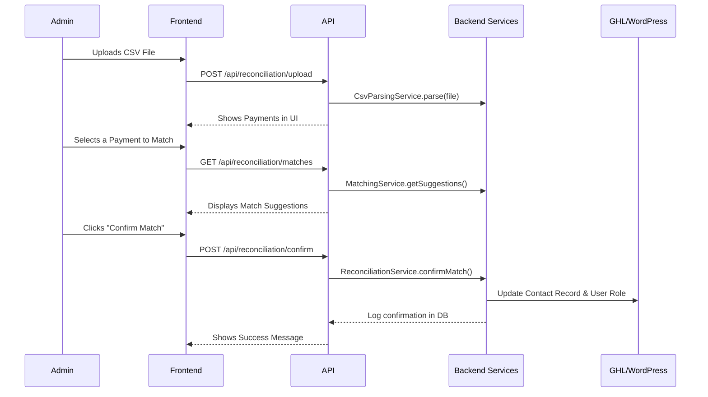

# NADSA GHL Client Manager Brownfield Enhancement Architecture

## Introduction

This document outlines the architectural approach for enhancing the NADSA GHL Client Manager with a new Membership Reconciliation Dashboard and security overhaul. Its primary goal is to serve as the guiding architectural blueprint for AI-driven development of the new features, ensuring seamless and secure integration with the existing system.

### Existing Project Analysis

  * **Current Project State**: The application is a monolithic Next.js **15.1.0** application using the App Router, with a PostgreSQL database managed by Prisma **6.9.0**. It serves as a custom admin UI for managing GoHighLevel (GHL) contacts.
  * **Available Documentation**: The primary technical reference is the `brownfield-architecture.md` document, which details the existing system's state prior to this enhancement.
  * **Identified Constraints**: The new solution must operate within the existing Next.js/Vercel architecture. A key constraint is the build process's current configuration to ignore TypeScript and ESLint errors, which must be rectified as part of this enhancement.

### Change Log

| Change | Date | Version | Description | Author |
| --- | --- | --- | --- | --- |
| Created | 2025-08-07 | 1.0 | Initial draft of enhancement architecture | Winston (Architect) |

## Enhancement Scope and Integration Strategy

### Enhancement Overview

  * **Enhancement Type**: New Feature Addition (Reconciliation Dashboard), Major Feature Modification (Security Overhaul), and New System Integration (WordPress).
  * **Scope**: To create a secure, semi-automated dashboard for reconciling membership payments from bank/Stripe reports and automatically updating member roles in GHL and WordPress.
  * **Integration Impact**: **Significant**. This introduces a new core feature, modifies the foundational security model, and adds a new external integration.

### Integration Approach

  * **Code Integration**: New functionality will be built within the existing Next.js monorepo structure. New frontend components will reside in a new `src/app/admin/reconciliation/` directory, backend logic in `src/lib/`, and API routes in a new `src/app/api/reconciliation/` directory. The existing `middleware.ts` will be modified to protect these new admin routes.
  * **Database Integration**: A new Prisma migration will be created to add any fields required for the security overhaul and reconciliation tracking (e.g., for hashed bank account numbers). All database interactions will continue to use the existing Prisma client (`src/lib/prisma.ts`).
  * **API Integration**: The enhancement will consume the existing GHL API via `src/lib/ghl-api.ts` and will require a new client service for interacting with the WordPress REST API.
  * **UI Integration**: The new dashboard will be a new page within the existing application, reusing shared components from `src/components/` and existing Tailwind CSS styles to ensure a consistent look and feel.

### Compatibility Requirements

  * **Existing Functionality**: The enhancement must not introduce any breaking changes to existing APIs or negatively impact the performance or functionality of the current application.
  * **Database Schema**: All database schema changes must be backward compatible and applied via incremental, reversible migrations.
  * **WordPress**: The solution must be compatible with WordPress v6.8.2 and operate correctly with the Wordfence security plugin active.

## Tech Stack Alignment

### Target Technology Stack

This enhancement will be built using the following target versions, which in some cases represent an upgrade from the versions currently in the project. The dependency upgrade process will be a managed part of the initial development stories.

| Category | Target Technology | Target Version | Usage in Enhancement |
| :--- | :--- | :--- | :--- |
| Framework | Next.js | **14.2.31** | New dashboard pages, API routes. |
| UI Library | React | **19.1.1** | Building all new UI components. |
| Database ORM | Prisma | **6.13.0** | Handling schema migration and data access. |
| Authentication | NextAuth | **4.24.11** | Will be reconfigured and enhanced. |
| Styling | Tailwind CSS | **v4.1.11** | Styling all new components. |
| Language | TypeScript | **5.9.2** | All new code will be written in TypeScript. |

### New Technology Additions

To meet the new requirements for testing and integration, the following libraries will be added to the project.

| Technology | Recommended Version | Purpose | Rationale |
| :--- | :--- | :--- | :--- |
| Jest & React Testing Library | Latest | Component and Unit Testing | To fulfill the new testing requirement in the PRD and establish a testing foundation. This is the industry standard for testing React applications. |
| Axios | Latest | HTTP Client | To provide a robust client for communicating with the external WordPress REST API, offering better error handling and interceptors than the basic `node-fetch`. |

## Data Models and Schema Changes

### New Data Models

#### `ReconciliationLog`

  * **Purpose**: To provide a verifiable audit trail of all reconciled membership payments.
  * **Key Attributes**: `id`, `transactionFingerprint` (unique), `paymentDate`, `amount`, `source`, `transactionRef`, `reconciledAt`, `reconciledByUserId`, `contactId`.

#### `PaymentSource`

  * **Purpose**: To securely store a hashed identifier for a member's payment source (e.g., bank account) to assist with future reconciliations.
  * **Key Attributes**: `id`, `hashedIdentifier` (unique), `sourceType`, `contactId`.

### Schema Integration Strategy

  * **Database Changes**: Two new tables (`ReconciliationLog`, `PaymentSource`) will be added. No modifications to existing tables are required.
  * **New Indexes**: A unique index will be created on `ReconciliationLog(transactionFingerprint)` and an index on `PaymentSource(hashedIdentifier)`.
  * **Migration Strategy**: All schema changes will be implemented via a new, single Prisma migration file.

### Duplicate Transaction Handling

To prevent re-matching previously imported data, the system will generate a unique `transactionFingerprint` for each transaction upon import.

  * **For Stripe Reports**: The unique `source_id` will be used as the fingerprint.
  * **For Bank CSVs**: A unique fingerprint will be generated by hashing the combined `Transaction date`, `Credit Amount`, and `Transaction Description`.
  * **Import Logic**: The system will check if a fingerprint exists in the `ReconciliationLog` before processing a new transaction. If it exists, the transaction will be skipped.

## Component Architecture

### New Components

#### Backend Services (in `src/lib/`)

  * **`ReconciliationService.ts`**: Orchestrates the entire reconciliation process.
  * **`CsvParsingService.ts`**: Parses uploaded CSVs and applies data privacy rules.
  * **`MatchingService.ts`**: Contains the "smart matching" logic against GHL contacts.
  * **`WordPressService.ts`**: A new client for the WordPress REST API.
  * **`AuthService.ts` (enhancements)**: Modifications to add brute-force protection.

#### API Routes (in `src/app/api/reconciliation/`)

  * **`upload/route.ts`**: Handles file uploads.
  * **`matches/route.ts`**: Provides smart match suggestions to the frontend.
  * **`confirm/route.ts`**: Receives a confirmed match and triggers updates.

#### Frontend Components (in `src/components/reconciliation/`)

  * **`ReconciliationDashboard.tsx`**: The main parent component for the new page.
  * **`FileUpload.tsx`**, **`PaymentList.tsx`**, **`MatchSuggestions.tsx`**: UI components for the dashboard workflow.

### Component Interaction Diagram

