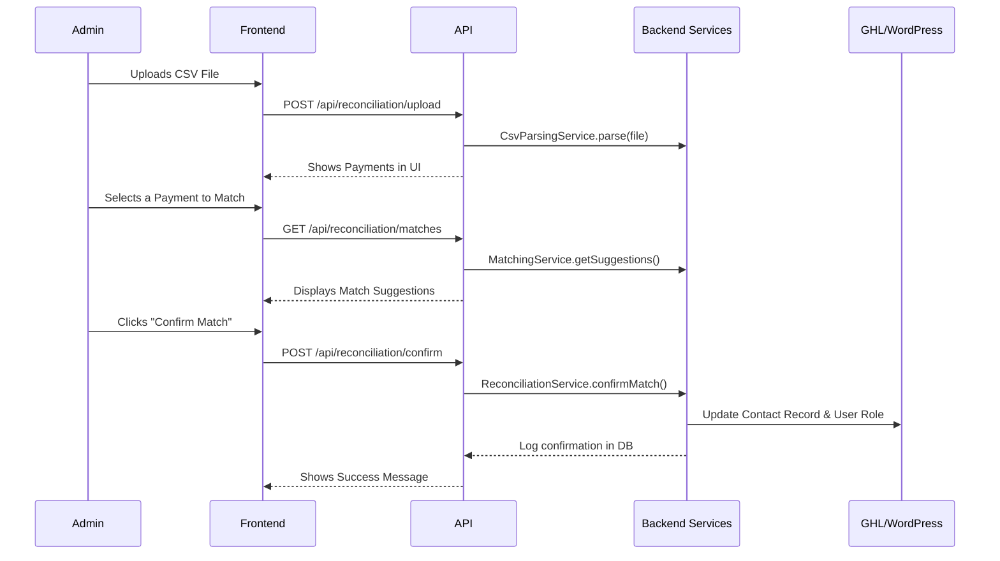

# Component Architecture

## New Components

### Backend Services (in `src/lib/`)

  * **`ReconciliationService.ts`**: Orchestrates the entire reconciliation process.
  * **`CsvParsingService.ts`**: Parses uploaded CSVs and applies data privacy rules.
  * **`MatchingService.ts`**: Contains the "smart matching" logic against GHL contacts.
  * **`WordPressService.ts`**: A new client for the WordPress REST API.
  * **`AuthService.ts` (enhancements)**: Modifications to add brute-force protection.

### API Routes (in `src/app/api/reconciliation/`)

  * **`upload/route.ts`**: Handles file uploads.
  * **`matches/route.ts`**: Provides smart match suggestions to the frontend.
  * **`confirm/route.ts`**: Receives a confirmed match and triggers updates.

### Frontend Components (in `src/components/reconciliation/`)

  * **`ReconciliationDashboard.tsx`**: The main parent component for the new page.
  * **`FileUpload.tsx`**, **`PaymentList.tsx`**, **`MatchSuggestions.tsx`**: UI components for the dashboard workflow.

## Component Interaction Diagram

